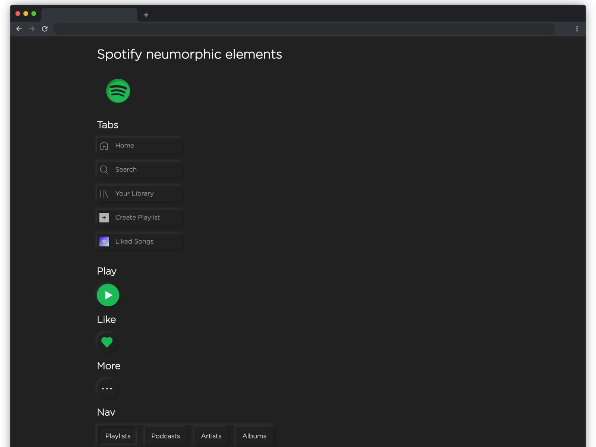
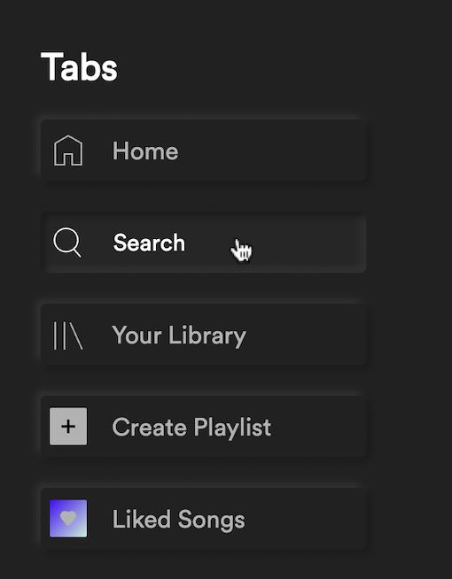
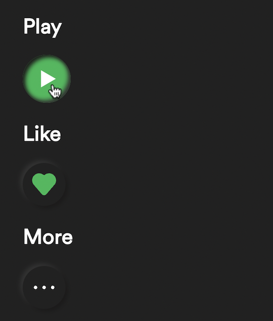
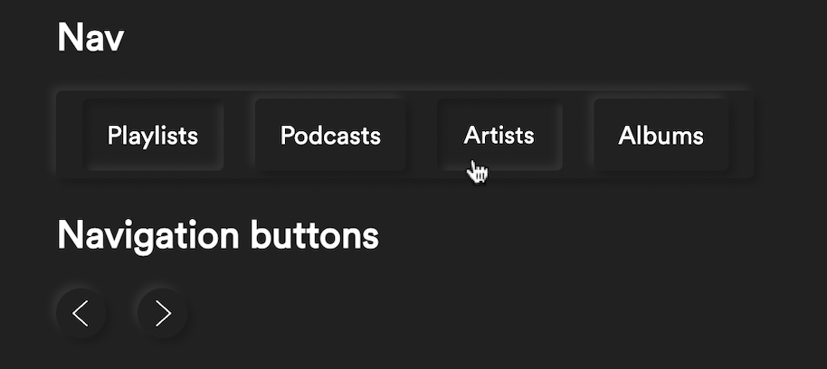
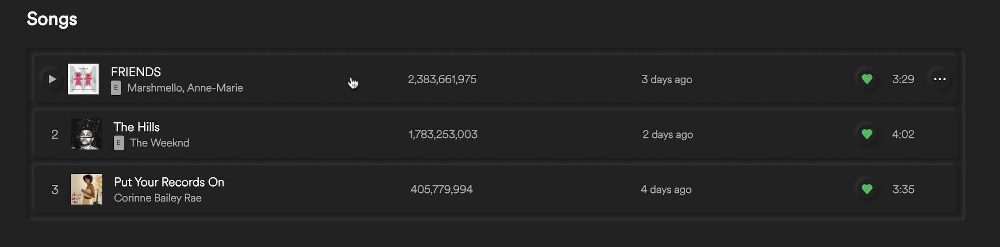
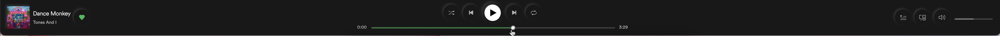

# Neumorphic Spotify ▶️ 

# Hi there!! 👋

Hope you you're doing well! 

I made a neumorphic version of Spotify, with `HTML`, `CSS`, and some `JS`! Well...kind of!

Basically, I just remade some of the components of spotify (cards, buttons, controls, etc.), but also made it neumorphic.

Here's how a bit how looks it like: 



***

## Links 🔗

* [Site 🌐](https://Neumorphic-Spotify.bookie0.repl.co)

* [Code ⚙️](https://replit.com/@Bookie0/Neumorphic-Spotify#README.md)

* [Dribbble 🏀](https://dribbble.com/shots/16954525-Neumorphic-Spotify)

* [Post 📝](https://replit.com/@Bookie0/Neumorphic-Spotify?c=143918)


***

## Features ✨

Here are the different types of components I recreated.

**Tabs**



- Icon of tab
- Title of tab

**Buttons**



- Icon of button

**Nav elements**



- Navbar, also with tabs
- Active tab is pressed
- Buttons with left/right arrows

**Cards**


- Picture of playlist
- Title of playlist
- Description of playlist
- Play button that shows up on hover

**Songs**



- Number of song
- Album cover image
- Title of song, artists, explicit 
- Number of plays, date added 
- Like button, duration of song
- Play button and ellipsis that show up on hover

**Media control**



- Album cover image 
- Title of song, artist
- Like button
- Top controls: shuffle, previous, play, next, repeat
- Progress slider
- Queue, devices, volume, volume slider


## Style 🎨 

**Font family**

Spotify uses a variation of the Gotham Medium font; the most visible difference being a round dot on the `i`. It is called Spotify Circular. I managed to download the fonts from [ondesblog.com](https://onedesblog.com/spotify-circular-font-free-download/#google_vignette), and used a regular font for most of the text and a bolder font for the headers.

**Neumorphism**

How does neumorphism work? Neumorphism makes everything look softer and more 3D like. Most of the elements have the same color as the background color of the page. You only see them because of the shadows. To look protruding, elements have a dark shadow on 2 sides (typically the bottom and right) and a light shadow on the others. Then, when you click on them, the shadows reverse. This makes it look like you're actually clicking a real button. 

I made a `CSS` class called `.shadow`, and applied it to all elements (so I didn't have to copy the shadow code for every single property). By default, elements have this shadow:

```css
box-shadow: 3px 3px 5px #1b1a1a, -3px -3px 5px #323232, inset 0 0 0px #1b1a1a, inset 0 0 0px #323232;
```

As you can see, I have the usual 2 first shadows: a dark one (`#1b1a1a`) on the bottom and right side and a lighter shadow (`#323232`) on the top and left side. You can see that I also have inset shadows with no shadow offset. These 2 last shadows technically exist, but you can't see them because there's no shadow offset and no blur. This is to ensure a smooth transition with the second shadow, when the user clicks. 

And when the user clicks on an element, this is the new shadow:

```css
box-shadow: 0 0 0px #1b1a1a, 0 0 0px #323232, inset 3px 3px 5px #1b1a1a, inset -3px -3px 5px #323232;
```

The previous first 2 shadows are now 'hidden', and the last 2 shadows have an inset, with the dark shadow switching places with the lighter one. 

Like I said before, this makes it look like you're really clicking the button. I think it's a very cool effect!

Since neumorphism requires an element's color to be the same as the background color of the page, most of the buttons, cards, songs, etc. couldn't be styled to the original color. However, I used Spotify green (`#1DB954`) as the accent color for the CTA buttons such as the play button or the like buttons. 

While neumorphism looks pretty nice (at least, I think so), it's also kind of hard to use in design, mostly because you can't use many colors, but also because of accessibility issues. Only the shadows help an element show or protrude, and those shadows can be hard to see. This leads to some contrast issues, making it difficult for some people to distinguish clickable content. It's a fun way to design, but not always that user-friendly.

**Icons**

The icons are all SVGs taken from Spotify's source code. 

***


## Closing 🚪


Well, that's about all! Make sure to let me know any comments, suggestions, or questions if you have them! :D 

### Have an extraordinary day!!!


# Cya soon! 👋

