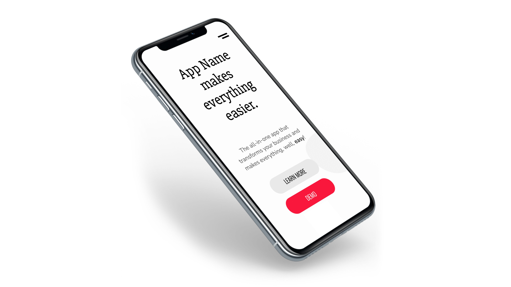
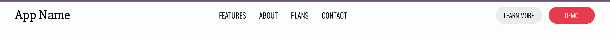
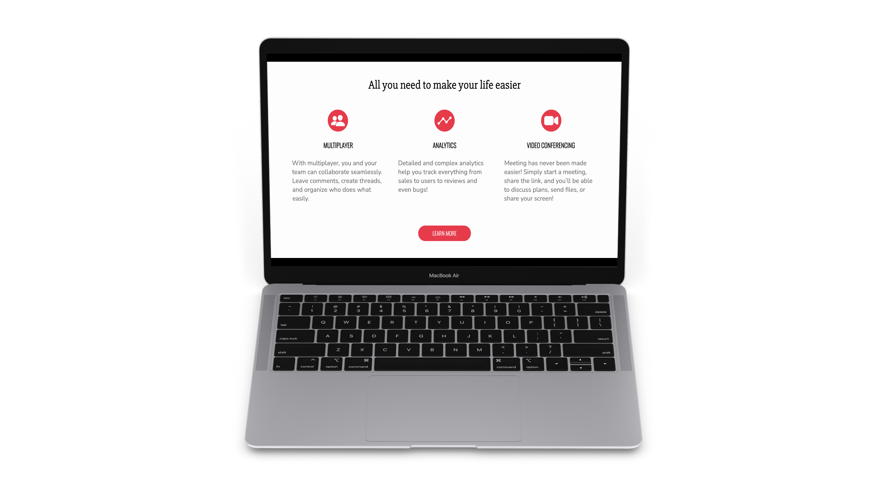
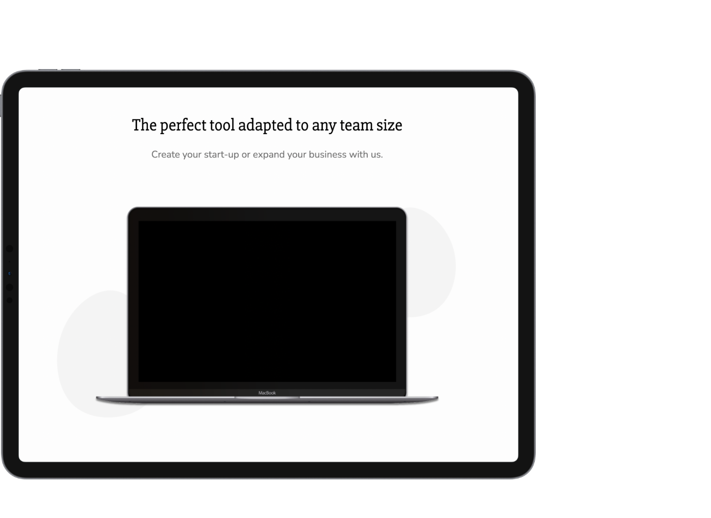
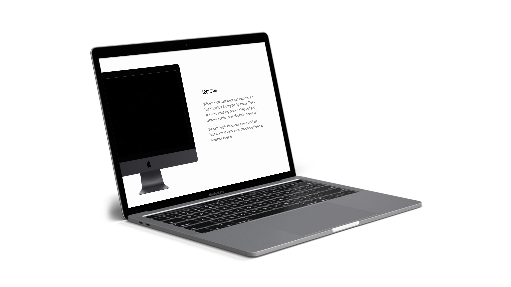
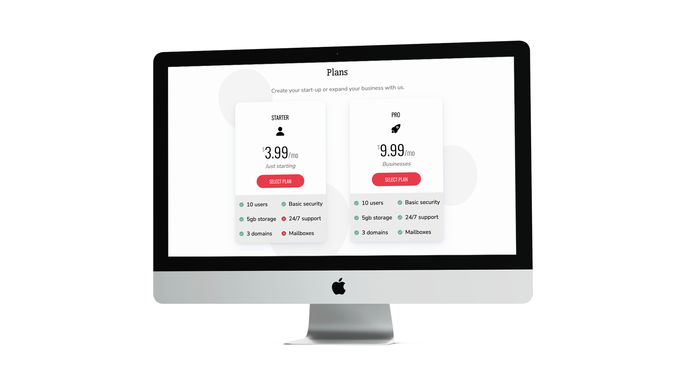
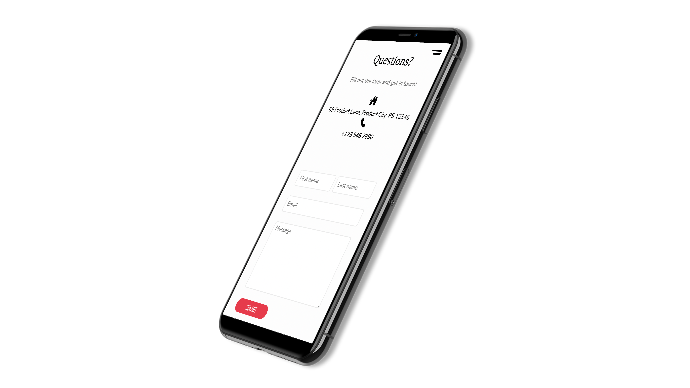
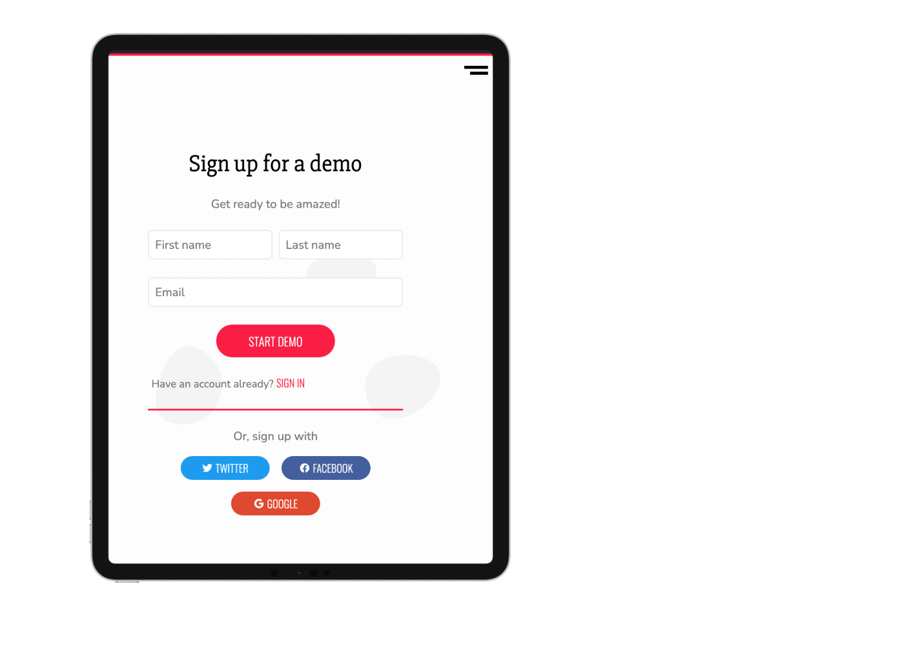
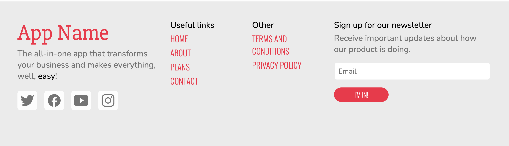
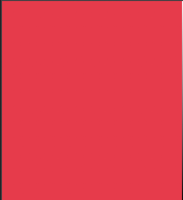

# App Product Page 🖥

# Hiii! 👋

Hope you you're doing well! 

I made the product page of an app, in `HTML`, `CSS`, and a bit of `JS`. It's sort of a template; most of the content (name, media, text, etc.) is just fake placeholder stuff. You can of course use it for your own apps/software, but just be sure to credit me! :)

It has landing pages, feature pages, about pages, sign up/sign in pages, and much much more! It

Here's how a snippet of how it looks like: 

It's also completely responsive, meaning that you can view it on any device; computer, tablet or phone!

## Links 🔗

* [Site/Demo ==> App-Product-Page.bookie0.repl.co](https://App-Product-Page.bookie0.repl.co)

* [Code ==> replit.com/@Bookie0/App-Product-Page](https://replit.com/@Bookie0/App-Product-Page#README.md)

* [Spotlight/Apps page ==> replit.com/@Bookie0/App-Product-Page?v=1](https://replit.com/@Bookie0/App-Product-Page?v=1)

* [Post ==> replit.com/talk/share/App-Product-Page/147665](https://replit.com/talk/share/App-Product-Page/147665)

* [Dribbble ==> dribbble.com/shots/16758085-App-Product-Page](https://dribbble.com/shots/16758085-App-Product-Page)

***

## Features ✨

**Navbar**

- Name of app on left
- Links in middle
- 2 buttons on right; 'Learn more' secondary button and 'Demo' call to action (CTA) button
- Navbar 'hides' itself when you scroll, and 'shows' itself when you hover
- On mobile, navbar has cool open/close animation and is fullscreen

**Landing page**

(View image at top of post)

- Headline with name of app
- Subtitle with slogan
- 2 buttons; 'Learn more' secondary button and 'Demo' CTA button
- Phone image 

**Features**

- Headline 
- 3 features; each with icon, title, and description
- 'Learn more' CTA button

**Demo**

- Headline
- Subtitle with short description
- Computer image

**About**

- Headline 
- Main text 
- Desktop computer image

**Plans**

- Headline
- Subtitle with short description
- 2 plans; starter and pro, each with:
  - Name of plan
  - Icon 
  - Price 
  - 1 or 2 word description 
  - 'Select plan' CTA button
	- Features of plans, with check or cross icon depending on wether it includes it or not

**Contact**

- Headline
- Subtitle with short description
- Address with icon
- Telephone number with icon
- Form with:
  - First and last name
  - Email
  - Message
	- 'Submit' CTA button

**Sign up/sign in**

- Headline
- Subtitle with short description 
- Form with:
  - First and last name
  - Email
  - 'Start demo'/'Sign in' CTA button
- Link to sign up/sign in accordingly
- Sign up/sign in options (Twitter, Facebook, Google)

**Footer**

- Headline with name of app
- Subtitle with slogan
- Social media icons
- Useful links 
- Other links 
- Form to sign up for newsletter with:
  - Header of newsletter
  - Subtitle explaining what it's for
  - Email
  - 'I'm in!' CTA button

## Style

**General layout**

The general layout of the site is simple, with the most important information (headers, buttons) standing out. Most of the sections start with a header in a big font so you know exactly what the section or page is for. Then, there's a subtitle that is smaller and lighter, and usually a CTA button. There's also some sort of media; either an image of a device (where pictures of the app could be placed, for example), or icons.

**Font family**

There are 3 font families that I've used in this website. The serif font family, used for headers and titles is `'Slabo 27px', serif`. The sans serif font family is `'Nunito', sans-serif`, used for most of the text. Finally, I use `'Oswald', sans-serif` for the small caps font family, used for links and buttons, and titles.

Nunito is a round, modern font, which goes well with the themes of this site (app, technology, devices, etc.). I find that it contrasts very well with the serif font, Slabo. When they are combined, mostly with Slabo as a title, and Nunito as the main body text, it looks great. Oswald stands out, especially because it's a narrow and small caps font. 

Here's an example where they're all together, with Slabo for the header, Oswald for the title of the feature and the button, and Nunito for the main text of the feature:

**Colors**

The main accent is a sort of pink/red/crimson accent color: `#fa1d44`. It looks like this:

You can check out the rest of the colors in the `:root` pseudoclass in `style.css`. All the colors and font families are kept in `CSS` variables. 

**Icons**

The icons, as usual, come from [Ionicons](https://ionic.io/ionicons), a great library filled with beautiful icons that you can customize easily. 

I used those icons to illustrate the features, plans, and contact information. They're also used for the social media links at bottom in the footer, and also in the sign up/sign in pages for the different options to sign up/sign in.

**Backgrounds**

Most of the site has a plain white (`#fdfdfd`) background, but some sections have an `SVG` as a background image. Those background images are 3 very light gray 'blobs' (sort of circles that aren't very perfect), and they're light enough to not grab the attention of the user, but can still be distinguished. 

These background images are used in the landing page, demo page, plans page, and contact section, as well as in the sign up/sign in pages.

**Device images**

The device images on the landing, demo, and about us section come from [Device Shots](https://deviceshots.com/). It's a really great site where you can upload images inside a bunch of device frames (phones, computers, watches, TVs, etc.) to make them look cool and realistic. 

***

## Closing 🚪

Well, that's about all! Make sure to let me know any comments, suggestions, or questions if you have them! :D 

### If there are any issues/bugs/things breaking, please comment them or DM me on Discord  @ `Bookie0#7538`.

*If you use this site, please keep in mind that I'd love if you gave credit, as I did put some effort into this! :)*

### Have an awesome day!!!

# Bye! 👋

